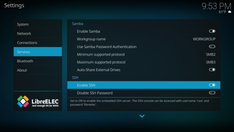
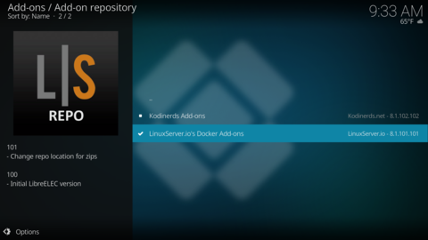
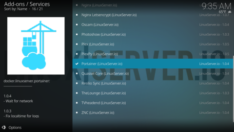
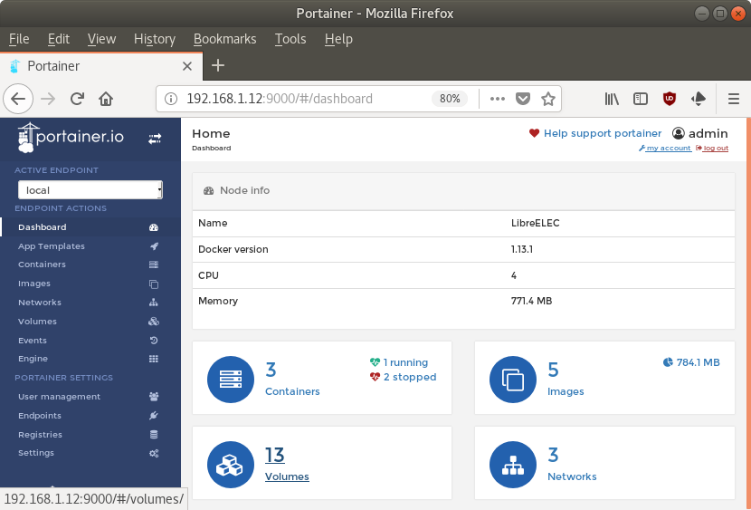
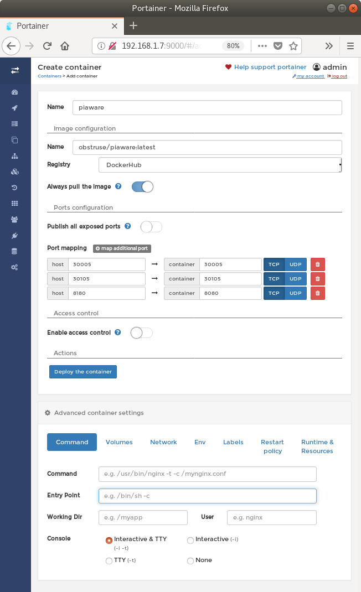

# PiAware
Automated Docker build of PiAware 3.8.1 + dump1090-fa + lighttpd. For Raspberry Pi

https://github.com/obstruse/PiAware-Docker/blob/master/README.md

Built on Docker Hub using cross-build emulation (QEMU):

https://hub.docker.com/r/obstruse/piaware/

Intended for use on LibreELEC(Kodi) with Docker and Portainer addons, but not required.

## Hardware

- Raspberry Pi 3 (https://www.adafruit.com/product/3055)
- RTL-SDR Dongle (e.g.: https://www.rtl-sdr.com/buy-rtl-sdr-dvb-t-dongles/ )

## Prepare Raspberry Pi

### Install LibreELEC

Boot the Pi using LibreELEC from NOOBS:

https://www.raspberrypi.org/downloads/noobs/

or using the LibreELEC installer:

https://libreelec.tv/downloads/

#### Enable SSH

* Kodi main menu -> Add-ons -> LibreELEC Configuration -> Services -> Enable SSH



#### Blacklist RTL Kernel Module

* Connect using SSH and create the blacklist file:

```
echo 'blacklist dvb-usb-rtl28xxu' > /etc/modprobe.d/blacklist-rtl28xxu.conf
```

* Reboot

### Install Add-ons:

Install the Docker add-on :

* Kodi main menu ->  Add-ons -> Install from repository 


* LibreELEC Add-ons -> Services -> Docker


Install the Portainer add-on:
* LibreELEC Add-ons -> Add-on Repository -> LinuxServer.io's Docker Add-ons



* Kodi main menu -> Add-ons -> Install from repository 
* LinuxServer.io's Docker Add-ons -> Services -> Portainer



## Install Piaware

Access Portainer at:  http://192.168.1.12:9000 (replace the IP with the address of your Raspberry Pi)



### Deploy Container

* Containers -> Add container
  * Container name: Piaware
  * Image configuration Name: obstruse/piaware
  * Port mapping
    * 8180 -> 8080 (to avoid conflict with Kodi on 8080)
    * 30005 -> 30005 (data in Beast format)
    * 30105 -> 30105 (MLAT data in Beast format)
  * Disable Access control
  * Console:  Interactive & TTY
  * Restart policy: Unless stopped
  * Runtime & Resources: Privileged Mode
* Click **Deploy the container**




The PiAware Skyview web page will be available on port 8180 on your Raspberry Pi;
the OpenLayers3 web page will be available on port 8181.

### Claim your PiAware client on FlightAware.com

https://flightaware.com/adsb/piaware/claim

### Set Location and Height of Site

Go to your stats page:

https://flightaware.com/adsb/stats/user/yourusername

Click on the gear icon to the right of your site name, and configure location and height.

### Changing Feeder ID

The feeder ID is assigned when the feeder first connects, and is stored in the PiAware instance.  If you redeploy PiAware, a new feeder ID is assigned and will look like a new site on FlightAware. If you want to continue using the same site after redeploying, you need to manually reconfigure the feeder ID.

* Find the feeder ID that you want to use. Go to:  https://flightaware.com/adsb/stats/user/yourusername. The feeder ID is labeled "Unique Identifier",
* Using Portainer, open a console on the PiAware instance and enter:
```
piaware-config feeder-id
```
* Paste the unique identifier.
* Restart piaware
